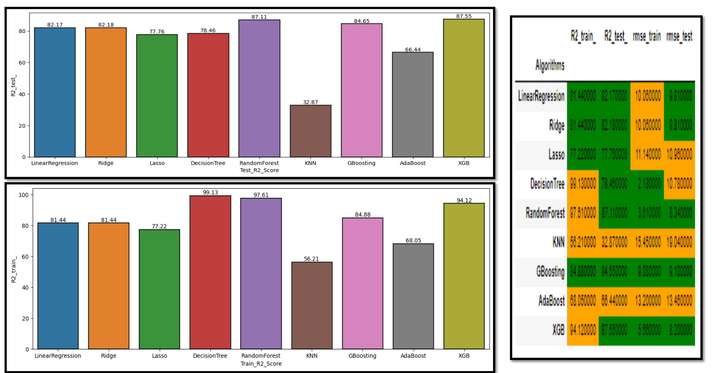
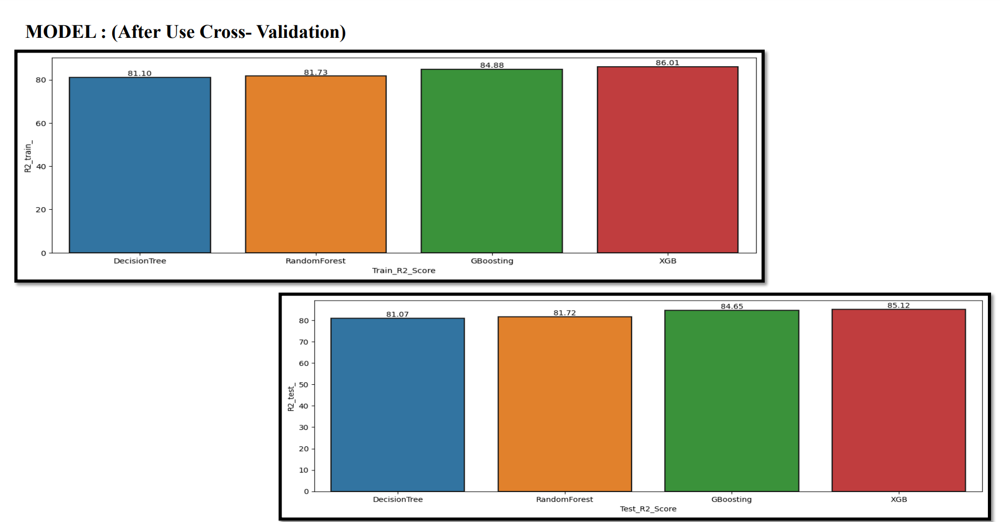
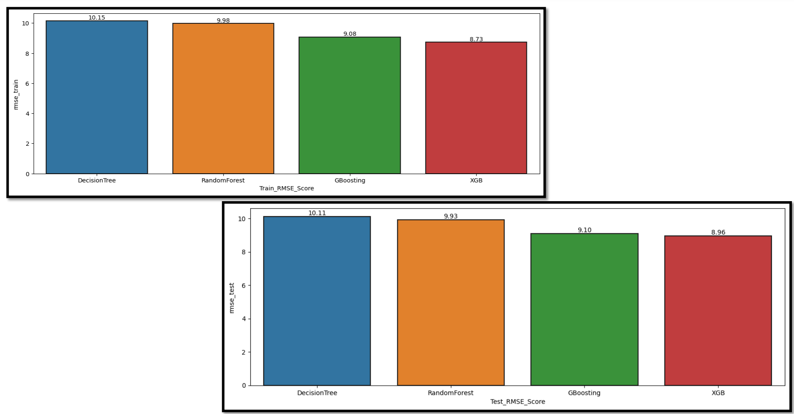

# Property Price Prediction

## Introduction
Property Price Prediction is crucial for companies like 99acres and Magic Bricks. Understanding factors like property age and area helps in efficient resource allocation and decision-making.

## Objective
The objective is to develop a predictive model leveraging machine learning and deep learning algorithms for accurate property value prediction.

## Process Flow
1. Topic Selection
2. Dataset Search
3. Data Pre-processing & Visualization
4. Algorithm Application
5. Model Building
6. Interpretation & Conclusions

## Tools & Platform Used
- Tools: Python
- Platform: Jupyter Notebook, AWS, Visual Studio Code
- Libraries: Sklearn, Pandas, NumPy, Seaborn, Matplotlib, NLTK, TensorFlow

## Data Pre-processing & Visualization
- Data Description
- Handling Null and Duplicate Values
- Outlier Treatment
- Data Cleaning
- Data Visualization
- One-Hot-Encoding for Categorical Variables
- Data Partition

### Details of Dataset
- 38,502 entries & 85 columns
- 32 categorical and 53 numerical columns
- No duplicate values
- Outliers detected using Boxplot
- Missing values in specific columns filled with median due to outliers

## NLP Analysis
- Term Document Matrix (TDM) for description & secondary tags
- Sentiment Analysis for description & secondary tags
- Conversion of Categorical Variables into Dummy Variables

## Model (Machine Learning)
- Linear Regression
- Ridge Regression
- Lasso Regression
- K-Nearest Neighbors
- Decision Tree
- Random Forest
- Gradient Boosting
- Adaptive Boosting
- XGBoost

## Model (Deep Learning)

In the context of property price prediction, deep learning refers to the use of artificial neural networks (ANN), a class of machine learning algorithms inspired by the structure and function of the human brain. The ANN model is trained on a large dataset consisting of various features related to properties such as age, area, and other relevant factors. During training, the model learns to recognize patterns and relationships between these features and the target variable, which is the property price.

### Cost Function
The cost function used in the ANN model is the Mean Absolute Error (MAE), which measures the average absolute difference between the predicted property prices and the actual prices in both the training and testing datasets.

- **Train MAE**: 4.92
- **Test MAE**: 5.19

### Accuracy
The accuracy of the ANN model is evaluated using the R2 Score, which represents the proportion of the variance in the property prices that is predictable by the model. 

- **Train R2 Score**: 83%
- **Test R2 Score**: 82%

## Conclusion

1. **Performance Comparison**: The XGBoost algorithm outperforms other machine learning algorithms in terms of Root Mean Square Error (RMSE) and R2 value, indicating its superior predictive capability in estimating property prices.

2. **ANN Model Evaluation**: Despite XGBoost's superiority, the ANN model demonstrates promising results with a relatively low cost function and high accuracy. This suggests that deep learning approaches, such as artificial neural networks, hold potential for accurate property price prediction and warrant further exploration and refinement.

